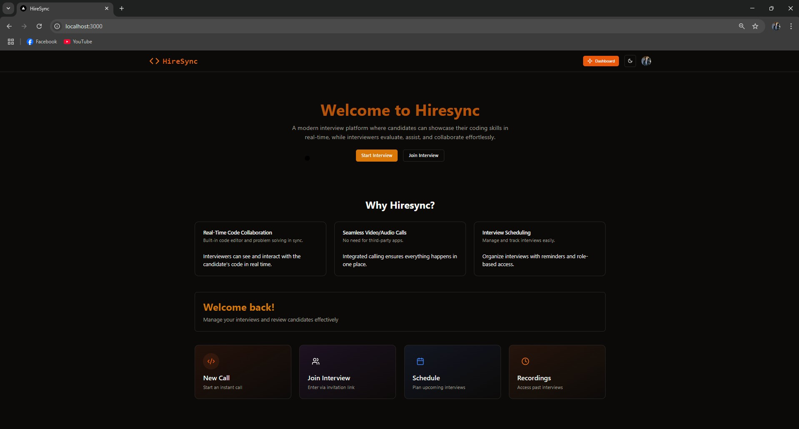
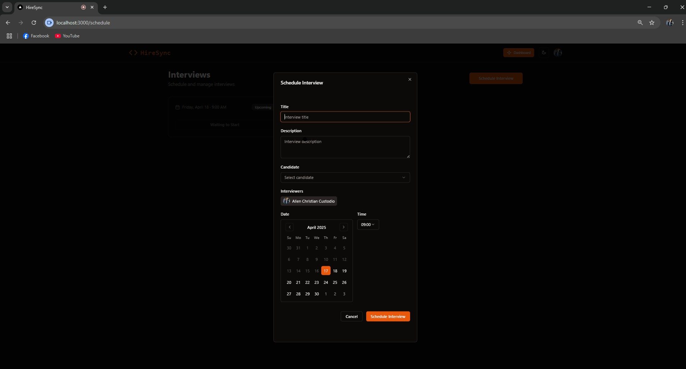
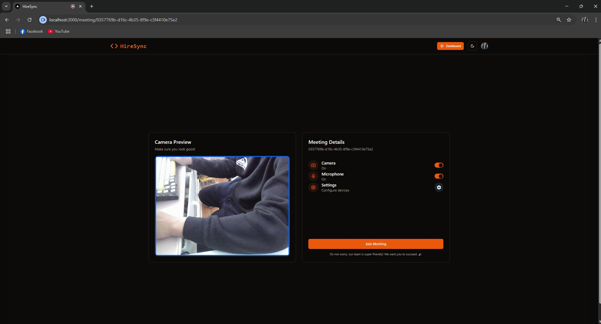
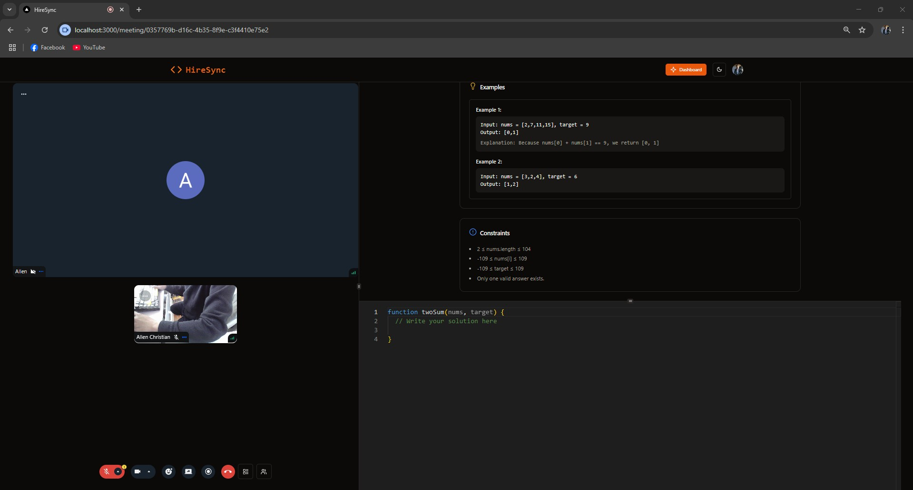
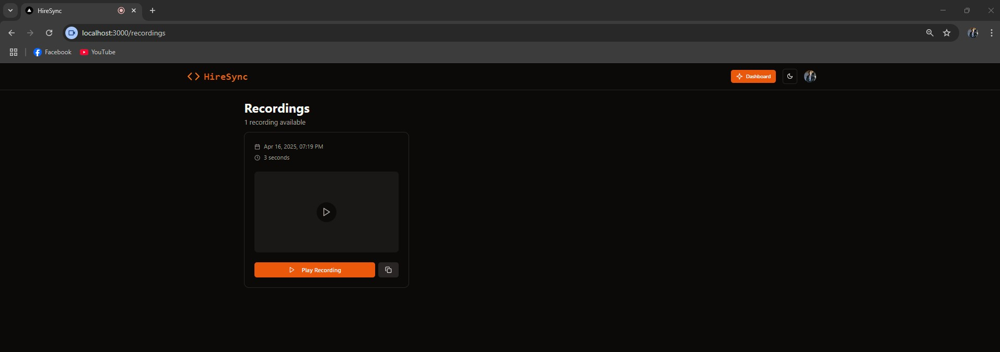

# 🧑‍💻 Hiresync – Code-Ready Video Interview Platform

Hiresync is a real-time coding interview platform built for both interviewers and candidates. It offers a smooth, integrated experience where users can schedule, join, and conduct interviews with built-in video calls and collaborative coding.



## ✨ Features

- ✅ Real-time code editor with Monaco
- ✅ Secure video/audio calls using Stream
- ✅ Interview scheduling and role-based access
- ✅ Authentication with Clerk
- ✅ Blazing fast backend using Convex
- ✅ Elegant UI with ShadCN, Tailwind, and Radix UI

---

## 🛠 Tech Stack

| Tech        | Description                             |
|-------------|-----------------------------------------|
| **Next.js** | React Framework for Fullstack App       |
| **Convex**  | Real-time Backend-as-a-Service (BaaS)   |
| **Clerk**   | Authentication & User Management        |
| **Stream**  | Video Call & Communication SDK          |
| **ShadCN/UI** | Accessible UI components using Radix |
| **Tailwind CSS** | Utility-first CSS for styling     |
| **Monaco Editor** | Code editing experience like VSCode |
| **TypeScript** | Type-safe modern JavaScript          |

---

## 📸 Screenshots

| Page                | Screenshot |
|---------------------|------------|
| 🏠 Home             |  |
| 📅 Schedule         |  |
| 🛠 Setup Meeting     |  |
| 💬 Meeting Room     |  |
| 📹 Recording        |  |
| 👨‍💻 Interview Page |  |

---

## 🚀 Getting Started

```bash
npm install
npm run dev
